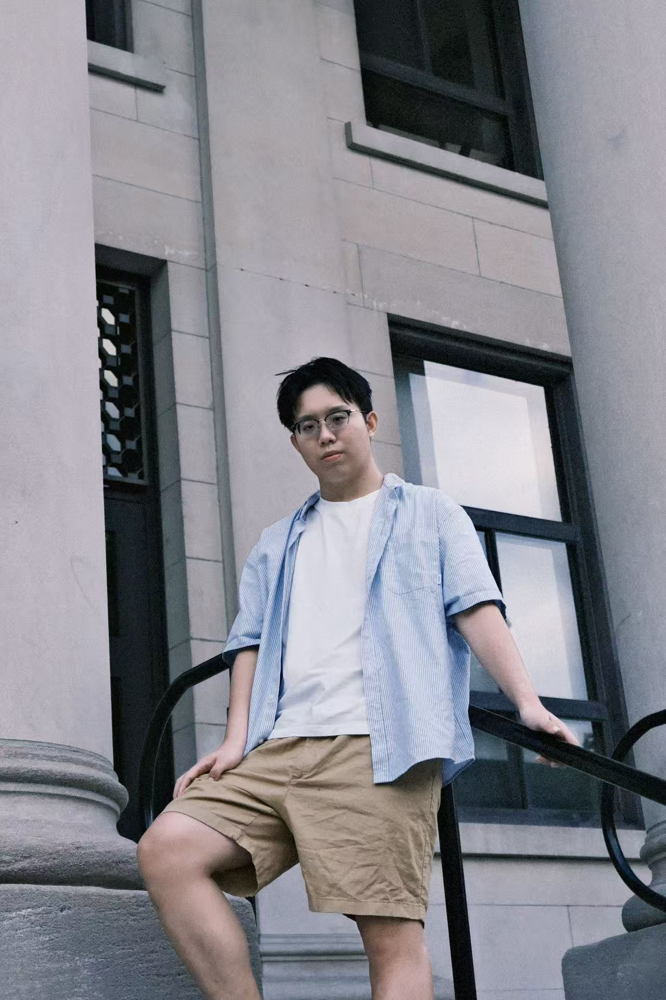

{width=250px}

I am currently a student in the UBC Master of Data Science program. Before MDS, I studied Statistics at the University of Ottawa. Through the MDS program, I hope to connect the mathematical theory I learned as an undergraduate with computer science and practical applications. Outside of academics, I enjoy soccer, basketball, and esports, and I also look forward to meeting new people and broadening my perspectives through the program.
