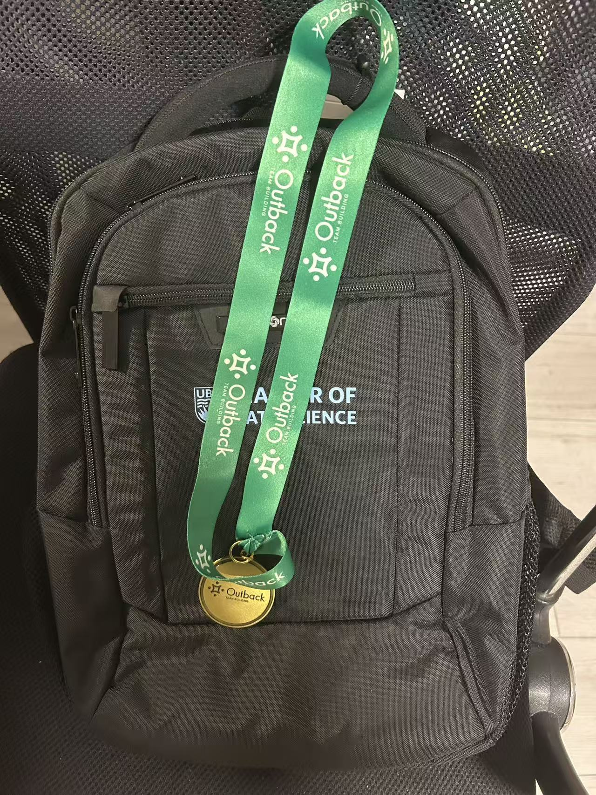

My first few weeks in the UBC Master of Data Science program have been busy but exciting. Orientation gave me a chance to learn more about the program, meet classmates, and get familiar with the campus. Starting a new program in a new environment also made the first few days feel very different from my undergraduate experience.

The first week of classes showed me that the MDS program moves quickly and focuses strongly on practical work. I have already been using tools such as Git, GitHub, R, Python, and Quarto in different courses. One thing that surprised me was how much emphasis the program places on learning through hands-on assignments and working with tools that are commonly used in real data science workflows.

So far, I am enjoying the experience and gradually getting used to the pace of the program. I hope to improve both my technical skills and my ability to apply what I learn to practical problems. I am also looking forward to getting to know more people in the program and experiencing more of what MDS has to offer.